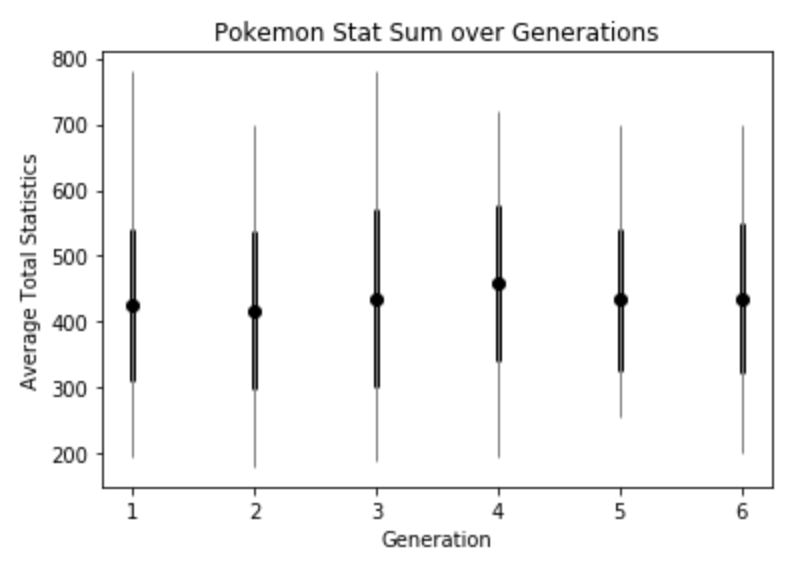
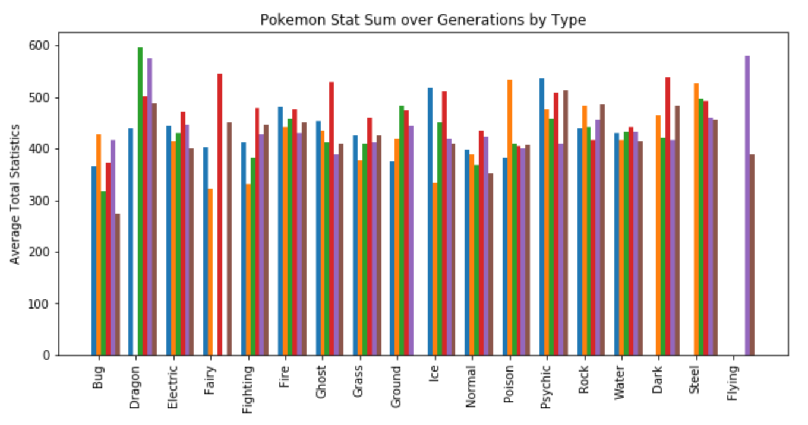

# Pocket Monsters
-----

In this notebook I am making visualization of pokemon using SQL queries to pull data from an RDS database and then graphing them to give insights on different questions.

If you would like to do your own analysis, you will need to set up your own SQL database and add the information for each pokemon to a table. After you do though you can alter my notebook [here](Pocket Monsters EDA.ipynb)

I was very in touch with pokemon when it first came out, but I would like to refresh my knowledge.

-----

### What kind of information do we have on each pokemon?

| name |	type1 |	type2 |	total |	hp |attack |defense |spattack |spdefense |speed |generation |legendary|id|
|---:|:-----:|:-----:|:-----:|:-----:|:-----:|:-----:|:-----:|:-----:|:-----:|:-----:|:-----:|---:|
|0 	|Bulbasaur |Grass|Poison|318|45|49|49| 65|65| 45| 1 |False| 1|
|1 |	Ivysaur| 	Grass| 	Poison |	405|60| 62| 63| 80| 80| 60| 1| False| 2|
|2 |	Venusaur 	|Grass 	|Poison |	525 |80 |82 |83 |100 |100 |80 |1 |False |3|

-----

### What are the different distributions of types?

I know that the type1 and type2 will have different distributions so I will graph both separately.

-----

### How many pokemon do they consider legendary?

When I was playing there were 3 legendary birds, Articuno, Flores and Zapdos. Also there was Mew and Mewtwo. I feel like they have introduced more legendaries since then.

Now there are 65...that's a lot of legends!

-----

### How are pokemon's numerical attributes correlated?

The unit here is the pearson correlation coefficient.

No columns have a negative correlations! This makes sense because it would be quite game breaking if any column was always the polar opposite of another. This would lead to stale gameplay.

-----

### What does the join distributions of different attributes look like?

All of these values have been normalized into the zero one interval. I think that it is clear to see most pokemon have stats far below the pokemon with the highest in that stat, implying there are some pokemon with exceptional values for each attribute.

-----

### Is there a power creep?

I'm going to consider a pokemon objectively more powerful for this task if the sum of it's numerical characteristics is greater. A large simplification, but true most of the time I'd say. I wish I had data on  which pokemon win matches, then I could come up with coefficients which would represent the importance of each statistic. Without this information, I am taking the naive approach and calling them all equally important.

This plot is showing the mean (dots), standard deviations (dark boxes) and the mins and maxes (ends of light lines) of the total statistics for each pokemon in each generation. I think there is a significant move of the mean in generation 4. A change of 20 points over 150 pokemon is quite different.

I am curious though whether this difference is the same over all types or if it just a change from generation to generation.

I apologize for the busy graph, but I think this is the clearest way to represent the change in a types viability in between generations.

I remembered flying Pokemon but I suppose it was not a type, but now it is! I'd say the variance in absolute power seems to be very different for various types. I'd say this implies to me that they use types to balance each other and are responding to various imbalances.

This EDA obviously does not take into account the strength of the moves which a pokemon has. I would like to investigate this in the future.

Hoped you enjoyed a little pokemon related EDA
